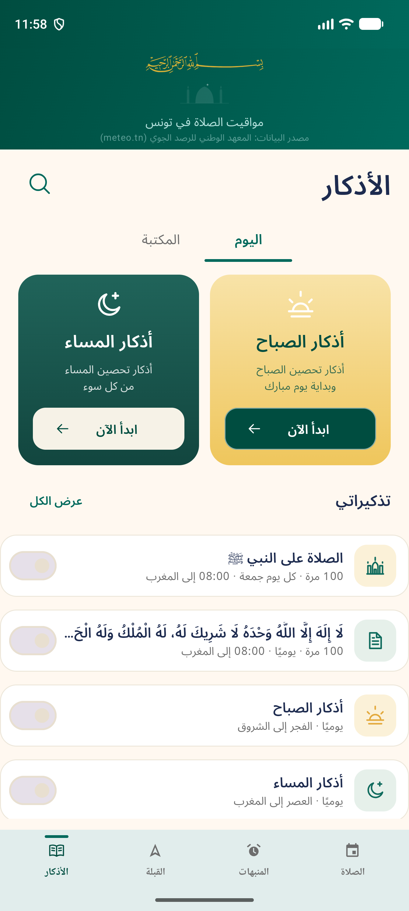
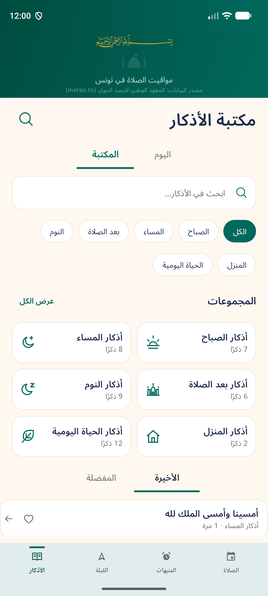
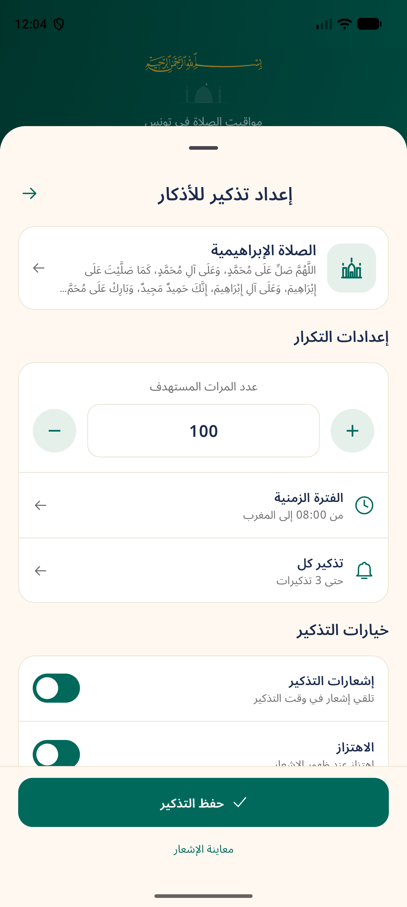
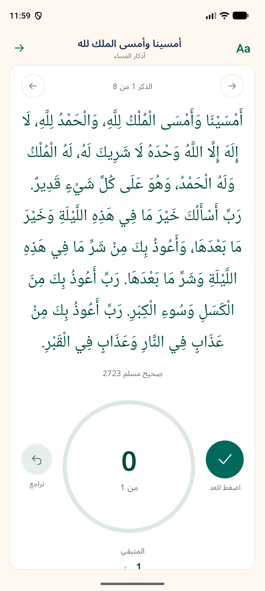

# Adhkar — approved mockup implementation

Implemented in the existing Android/Compose app. The four attached screens are the visual target; all controls are wired to the real adhkar state, repository, scheduler, and catalog.

## Delivered screens

1. **Home** — shared green prayer masthead, compact "الأذكار" title with search action, centered Today/Library tabs, gold morning and teal evening reading cards, compact "تذكيراتي" rows for salawat, tahlil, morning, and evening, and "تصفح حسب الحالة" shortcuts. Bottom navigation is unchanged from the other tabs.
2. **Reminder editor** — full-height sheet with the selected-dhikr card, target stepper, time-window and cadence rows, notification/vibration toggles, quick templates, and a fixed primary save button. Morning/evening collection reminders omit the personal repetition-target controls.
3. **Reader and counter** — large Noto Naskh Arabic text, inline source reference (opens the source sheet), circular progress counter with dedicated counting action, undo, previous/next controls in the card header and below, remaining count, progress segments, and text-size adjustment via "Aa" (with the count-haptics switch preserved there).
4. **Library and search** — "مكتبة الأذكار" title, search field, category chips, real collection cards with catalog entry counts, and الأخيرة/المفضلة tabs with real reading history and favourites.

## Functional notes

- Reminder templates (home rows, quick templates) are never enabled until the user saves: home template rows start with the switch off and only save when switched on; quick templates only fill the editor.
- Collection reminders add `DhikrReminder.collection` (MORNING/EVENING). Their occurrence opens the whole collection session, and the notification title uses the collection name.
- Per-reminder vibration adds `DhikrReminder.vibrate`, applied through the notification builder. On Android 8+ the adhkar channel governs vibration, so the switch is effective only where the platform allows per-notification patterns; the channel settings link remains.
- LTR digits are used throughout the tab, matching the rest of the app.

## Deviations from the mockups (and why)

| Mockup element | Implementation | Reason |
| --- | --- | --- |
| Library has no Today/Library tabs | Tabs remain on the library page | Needed to return to the Today page; no other back affordance exists |
| Illustrative counts (118، 96، 120 …) | Real catalog counts (7، 8، 6، 9، 2، 12) | "Do not copy unverified collection totals" |
| "من فضله" virtue box | Omitted; source reference shown inline | Catalog has no verified virtue field; unverified virtues must not ship |
| "الخروج من المنزل" and similar chips | The six real catalog categories | Catalog has no such category |
| Undo labeled "إعادة" | Labeled "تراجع" | The control decrements one count; the label must match the action |
| Reader haptics control | Moved into the "Aa" dialog | Keeps the mockup layout while preserving the existing setting |
| Templates shown enabled | Off until saved | Explicit brief requirement |

## Verification

- `:app:compileDebugKotlin` — passed.
- `:app:testDebugUnitTest --tests com.tunisianprayertimes.adhkar.AdhkarFlowTest` — **14 passed, 0 failed**.
- `AdhkarReaderInstrumentedTest` on the API 37 emulator — **2 passed** (editor validation without saving; notification deep link, counting, undo, recreation, repeated open requests).
- Screenshots captured from the running app (Pixel-class emulator, 1344×2992): home, home shortcuts, library, reminder editor, templates, collection reminder, reader.

| Home | Library |
| --- | --- |
|  |  |

| Reminder editor | Reader |
| --- | --- |
|  |  |

Additional captures: [home shortcuts](21-home-situations.png), [quick templates](24-reminder-templates.png), [collection reminder](25-collection-reminder.png).

## Main files

| Area | Files |
| --- | --- |
| Home, library, reminder management | `android-app/app/src/main/java/com/tunisianprayertimes/ui/AdhkarScreen.kt` |
| Reader and counter | `android-app/app/src/main/java/com/tunisianprayertimes/ui/AdhkarReader.kt` |
| Reminder editor | `android-app/app/src/main/java/com/tunisianprayertimes/ui/AdhkarReminderEditor.kt` |
| Palette, tokens, shared components | `android-app/app/src/main/java/com/tunisianprayertimes/ui/AdhkarDesign.kt` |
| Model, persistence, delivery | `android-app/app/src/main/java/com/tunisianprayertimes/adhkar/` |
| Shared masthead | `android-app/app/src/main/java/com/tunisianprayertimes/ui/MainScreen.kt` |
| Icons | `android-app/app/src/main/res/drawable/ic_adhkar_heart*.xml`, `ic_adhkar_list.xml` |
