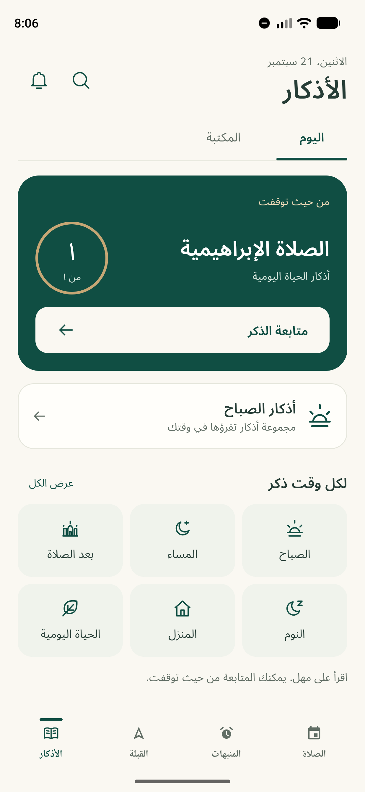
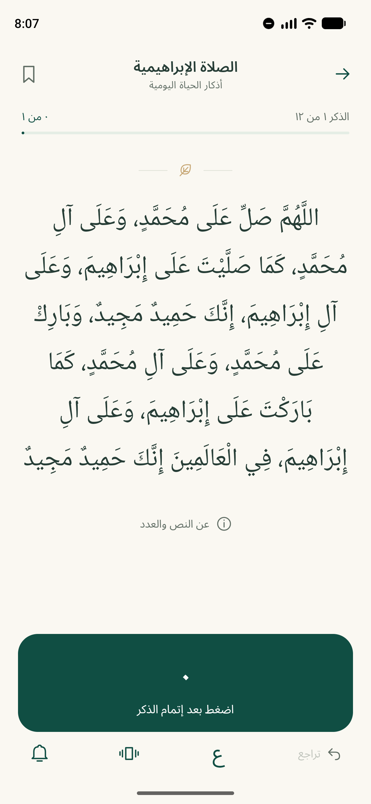
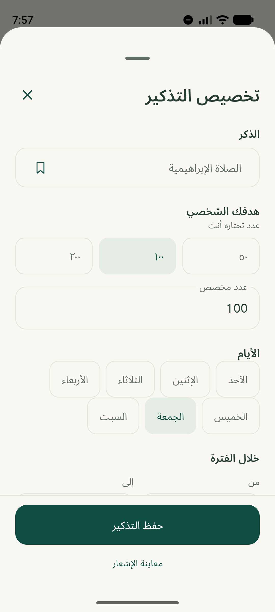
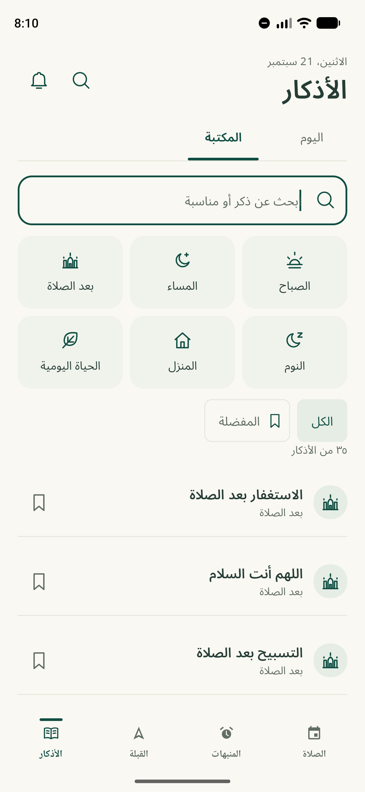

# Adhkar redesign — implementation and verification

Implemented in the existing Android/Compose app on 21 September 2026, using the supplied screenshot, interactive prototype, and Arabic-first brief as design references.

## Delivered experience

- Compact Adhkar header, Today/Library destinations, contextual resume card, secondary suggestion, and six categories. The shared prayer masthead is absent from this tab; prayer attribution remains in the prayer section. Bottom-navigation order is preserved.
- Full-screen Arabic reader with licensed Noto Naskh Arabic, adjustable text, explicit counting, undo, favourites, optional count haptics, sources, and deliberate collection navigation. Short landscape screens use separate text and counter panes.
- Search, Arabic normalization for matching only, saved favourites, useful empty results, and retained library context. The 35 existing entries remain packaged for offline reading, including home entry/exit and daily activities.
- Scrollable reminder sheet with fixed Save/preview actions, target and weekday controls, fixed/prayer-relative times, explicit next-day ranges, cadence independent of repetition targets, visible validation errors, and actual notification/channel restrictions.
- Friday preset: the user's exact salawat, personal target 100, Friday, 08:00–Maghrib, gentle cadence. Existing Friday routines open for editing. Opening the preset or its simulated preview does not schedule anything.
- Reminder management: enabled state, delivery eligibility, edit, skip an occurrence, delete with undo, and preserved reading history.

## State and scheduling decisions

- Content, reminder rules, dated occurrences, reading sessions, and delivery records are separate. Occurrence IDs include rule ID, revision, and local start date. Each occurrence snapshots its personal target.
- A standalone reading never satisfies a scheduled goal. Session position and accepted counts are committed together in local preferences before publishing updated UI state. Previous rules/counters migrate without silently resetting progress.
- Schedule/target edits replace the rule revision, stop the old open occurrence's nudges, retain its counts/target, and take effect in future periods. Enable/disable preserves the current occurrence's progress; delete preserves all history.
- Prayer anchors use the existing selected-city prayer repository. Fixed times and prayer wall-clock values follow the device timezone, consistent with the existing Android scheduling approach; overnight occurrences belong to their start date. No new location collection or prayer engine was added.
- One identifiable inexact alarm is pending per enabled rule. Gentle/balanced modes produce at most 3/5 nudges. Notification actions resume or snooze; neither counts a recitation. Snooze must remain inside the occurrence window.
- Delivery rechecks the saved event, occurrence, current rule revision, enabled state, completion, expiry, permission, channel, and active-reader presence. Stable event records prevent duplicates; late delivery does not replay a backlog. A two-minute global spacing guard suppresses bursts.
- Existing startup, schedule-refresh, city-change, and boot/clock-change integrations are reused, with a six-hour repair worker. Android can defer these gentle reminders; exact delivery is not promised. The Adhkar channel starts with vibration and no sound, subject to the user's channel settings and Do Not Disturb.

## Main files

| Area | Files relative to repository root |
| --- | --- |
| Today, Library, reminder management | `android-app/app/src/main/java/com/tunisianprayertimes/ui/AdhkarScreen.kt` |
| Reader and responsive controls | `android-app/app/src/main/java/com/tunisianprayertimes/ui/AdhkarReader.kt` |
| Reminder editor | `android-app/app/src/main/java/com/tunisianprayertimes/ui/AdhkarReminderEditor.kt` |
| Palette, typography, system bars | `android-app/app/src/main/java/com/tunisianprayertimes/ui/AdhkarDesign.kt` |
| Persistent model and delivery | `android-app/app/src/main/java/com/tunisianprayertimes/adhkar/DhikrModels.kt`, `DhikrRepository.kt`, `DhikrReminderScheduler.kt` |
| Navigation and notification links | `android-app/app/src/main/java/com/tunisianprayertimes/MainActivity.kt`, `ui/MainScreen.kt` |
| Catalog metadata and source notes | `android-app/app/src/main/java/com/tunisianprayertimes/adhkar/DhikrCatalog.kt`, `docs/adhkar-sources.md` |
| Assets | `android-app/app/src/main/res/drawable/ic_adhkar_*.xml`, `res/font/`, `assets/font-licenses/` |
| Focused verification | `android-app/app/src/test/java/com/tunisianprayertimes/adhkar/AdhkarFlowTest.kt`, `src/androidTest/java/com/tunisianprayertimes/AdhkarReaderInstrumentedTest.kt` |

Noto Naskh Arabic is from [Google Fonts](https://github.com/google/fonts/tree/main/ofl/notonaskharabic); the UI face is [Noto Sans Arabic UI](https://github.com/notofonts/noto-fonts/tree/main/hinted/ttf/NotoSansArabicUI). Their SIL Open Font Licenses are included in app assets. Fonts were obtained from their upstream distributions, not extracted from the prototype.

## Verification performed

- `:app:compileDebugKotlin` — passed. A debug build and test package were generated only for the requested emulator verification; no release was generated.
- `:app:testDebugUnitTest --tests com.tunisianprayertimes.adhkar.AdhkarFlowTest` — **14 passed, 0 failed**. Covers persistence, undo bounds, collection backtracking, independent counters, legacy migration, favourites/search normalization, revision/history/delete undo, Friday anchors on successive weeks, cadence independence, overnight ranges, DST, notification deduplication and links, stale-event rejection, active-reader suppression, snooze limits, permission/channel restrictions, and delayed delivery without catch-up bursts.
- `AdhkarReaderInstrumentedTest` on the API 37 emulator — **2 passed**. A notification-style deep link opens the exact occurrence; opening/scrolling does not count; a count and undo survive activity recreation; a second open request does not count. An invalid target shows an error beside the fixed Save action without creating/enabling a rule. The test restores the emulator's prior Adhkar state.
- Manual emulator checks: 360 dp and 412 dp normal layouts; 320 dp with 150% system text; portrait/landscape reader; light/dark themes and system-bar contrast; source sheet and long text scrolling; explicit next/back and undo; search focus and empty-result recovery; separate home entries; reminder body scrolling with fixed actions.
- Calculated contrast ratios: main text/ivory **10.97:1**, secondary text/ivory **5.04:1**, white/forest **9.58:1**, dark-theme secondary text/background **9.12:1**. Gold is decorative.
- Whitespace checks passed for the modified tracked implementation files. No unrelated staged work was reset or included in a commit.

## Screenshots

These are unedited captures of the running Android app, not prototype renders. The emulator's existing reading progress is shown. The capture day was Monday, so Today correctly shows a resumed session rather than a permanent Friday promotion. Reminder captures show an existing routine; the fresh preset's gentle defaults are verified separately in the tests.

| Today, 412 dp | Reader, 412 dp |
| --- | --- |
|  |  |

| Reminder, 360 dp | Library, 412 dp |
| --- | --- |
|  |  |

Additional captures: [cadence](03b-reminder-cadence.png), [summary](03c-reminder-summary.png), [dark Today](06-today-dark-412.png), [landscape reader](07-reader-landscape.png), [320 dp / large text](08-reader-large-320.png), [large-text editor](09-reminder-large-320.png), [dark editor](10-reminder-dark.png), [empty search](13-search-empty.png).

## Remaining release checks

- No externally approved replacement content dataset was supplied. The existing source-linked catalog was retained, with immutable IDs/version metadata. The exact user-supplied composite salawat is explicitly identified as user wording, not falsely attributed to a single narration. Religious-content editorial approval, particularly this wording, remains a release requirement.
- Actual vibration and long-running background delivery under physical-device/OEM battery policies require a device check. Automated tests cover delivery logic and restrictions, not physical vibration or every vendor's deferral behavior.
- Accessibility semantics, scalable layouts, labelled controls, and contrast were checked; a full spoken TalkBack/keyboard accessibility audit remains outstanding. Not every boot, city-change, unavailable-data, and permission-transition combination has been exercised on hardware.
- Android notification permission and the Adhkar channel must be enabled by the user for delivery. Reading and saved rules remain available when delivery is blocked. The notification preview is explicitly simulated.
